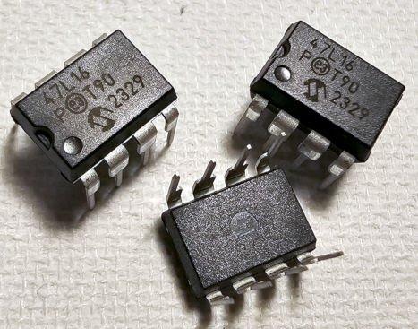

# Toit Library for a Microchip 47L04/47C04/47L16/47C16 4/16Kbit EERAM IC.
Toit Driver Library for a Microchip EERAM module - a flash backed ram module,
which copies data from SRAM to FLASH when it senses power off.



## About the Device
The Microchip Technology 47L04/47C04/47L16/47C16 (47XXX) is a 4/16 Kbit SRAM
with EEPROM backup. The device utilizes the I2C serial interface. The 47XXX
provides infinite read and write cycles to the SRAM while EEPROM cells provide
high-endurance nonvolatile storage of data. With an external capacitor, SRAM
data is automatically transferred to the EEPROM upon loss of power. Data can
also be transferred manually by using either the 'Hardware Store' pin or
software control. Upon power-up, the EEPROM data is automatically recalled to
the SRAM. Recall can also be initiated through software control.
[[datasheet](https://ww1.microchip.com/downloads/en/DeviceDoc/47L04_47C04_47L16_47C16_DS20005371D.pdf)]

> [!TIP]
> This device is made to store persistent data that could be written at
> rates high enough to cause damage to typical flash memory.  If the intended
> use case is for data that is saved once and not saved again, then Toit's
> [bucket feature](https://libs.toit.io/system/storage/class-Bucket) is probably
> more than enough.  It is far simpler and requires fewer components.

### Device Types
These IC's come in two voltage flavours and two size flavours.  Note that the
`L` and `C` indicate the supply voltage:
| Part # | Size (Density) | Voltage Range |
| - | - | - |
| `47L04` | 4Kbit | 2.7-3.6V |
| `47C04` | 4Kbit | 4.5-5.5V |
| `47L16` | 16Kbit | 2.7-3.6V |
| `47C16` | 16Kbit | 4.5-5.5V |

There are different capacities and model numbers available from different
manufacturers.


## Features/Operation

### Device Wiring
The IC requries a power capacitor.  A decoupling capacitor is also recommended.
There are no built-in pull up resistors either.  The datasheet shows that the
device will function without a power capacitor, however if power is removed
during a store operation, the data may become corrupt.  The datasheet gives
example wiring diagrams, and makes recommendations about the capacitor types
and values that are best to use.

### Auto Store Enable (ASE)
> [!WARNING]
> When the device is first turned used out of the box, 'Auto StoreEnable' (ASE)
> feature is disabled.  Until this is enabled the automatic save feature will
> not happen.  This is enabled automatically in the `PersistentMap` class, but
> not in the main `Eeram` driver.

ASE can be configured using `driver.enable-ase` or using `driver.disable-ase`.
The current setting can be determined using `driver.ase-enabled`.

### Library Classes
The library comes in the form of two classes:
* `Eeram` class:  The code implementing the Eeram features.
* `PersistentMap` class:  Implements an Eeram-backed Map object (utilises the
  above `Eeram` class.)

### Specific Functions
| class | functions | description |
| - | - | - |
| `Eeram` | ...todo... | ...todo... |
| `PersistentMap` | ...todo... | ...todo... |

## Example
Please see the [examples](.\examples) folder.  In principle, the device has two
I2C devices, the controller, and the memory device.  The controller receives
instructions such as `store` and `recall` (pushing data between SRAM and EEPROM)
and enabling ASE.  The usage pattern is thus:
```toit
SDA-PIN := 8
SCL-PIN := 9

// Initial setup for I2C.
frequency := 400_000
sda := gpio.Pin SDA-PIN
scl := gpio.Pin SCL-PIN
bus := i2c.Bus --sda=sda --scl=scl --frequency=frequency
scandevices := bus.scan

// Establish control and data devices.
if not scandevices.contains Eeram.I2C-CONTROL-ADDRESS:
  print "Eeram CONTROLLER not present"
  return
if not scandevices.contains Eeram.I2C-DATA-ADDRESS:
  print "Eeram SRAM not present"
  return

eeram-controller-device = bus.device Eeram.I2C-CONTROL-ADDRESS
eeram-data-device = bus.device Eeram.I2C-DATA-ADDRESS

// To use the device as a 'PersistentMap':
pmap := PersistentMap
      --control=eeram-controller-device
      --data=eeram-data-device
      --capacity=Eeram.CAPACITY-16KBIT

// To use the device as a memory device:
eeram := Eeram
      --control=eeram-controller-device
      --data=eeram-data-device
      --capacity=Eeram.CAPACITY-16KBIT

```

## Issues
If there are any issues, changes, or any other kind of feedback, please
[raise an issue](./issues). Feedback is
welcome and appreciated!

## Disclaimer
- This driver has been written and tested with an IC directly (pictured).
  Other modules do exist and may behave differently.
- All trademarks belong to their respective owners.
- No warranties for this work, express or implied.

## Credits
- [Florian](https://github.com/floitsch) for the tireless help and encouragement
- The wider Toit developer team (past and present) for a truly excellent product

## About Toit
One would assume you are here because you know what Toit is.  If you dont:
> Toit is a high-level, memory-safe language, with container/VM technology built
> specifically for microcontrollers (not a desktop language port). It gives fast
> iteration (live reloads over Wi-Fi in seconds), robust serviceability, and
> performance that’s far closer to C than typical scripting options on the
> ESP32. [[link](https://toitlang.org/)]
- [Review on Soracom](https://soracom.io/blog/internet-of-microcontrollers-made-easy-with-toit-x-soracom/)
- [Review on eeJournal](https://www.eejournal.com/article/its-time-to-get-toit)
